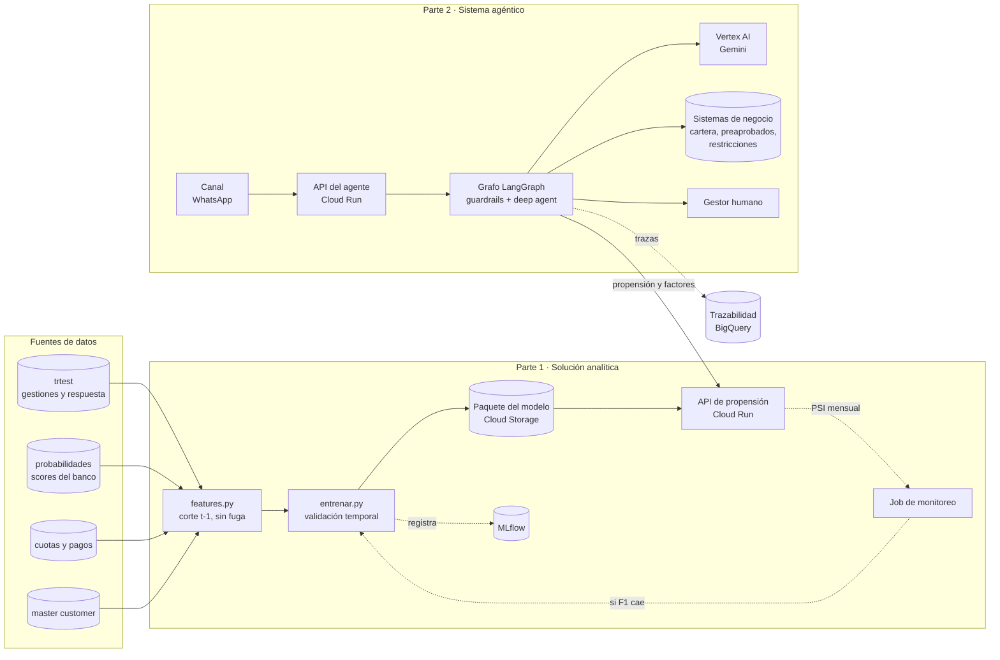
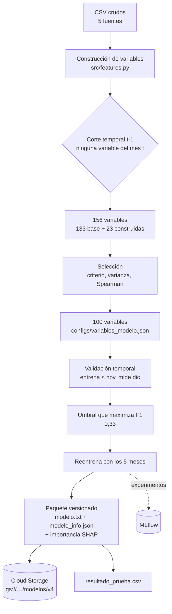
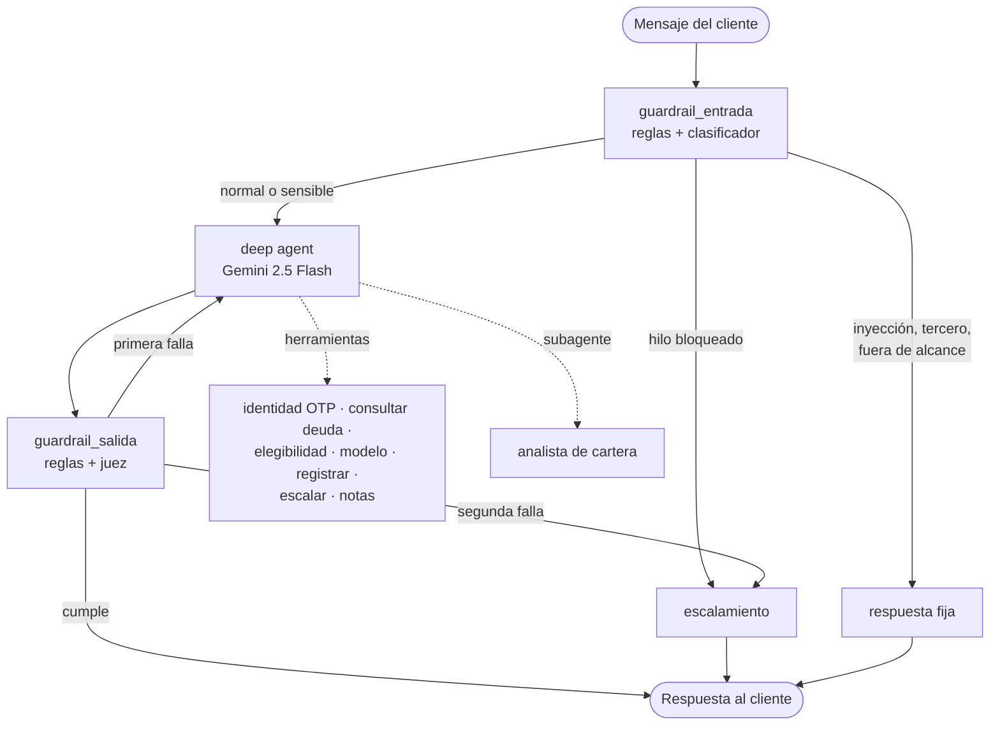
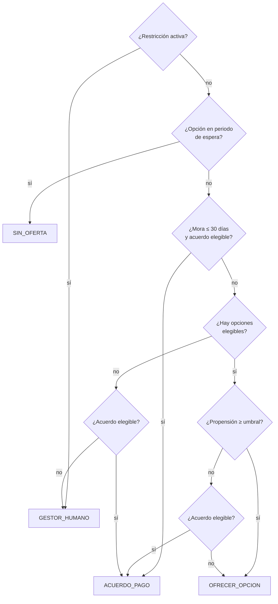
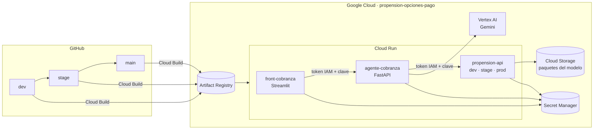

# Diseño de arquitectura y operación de la solución

Entregable 5 de la prueba. Describe cómo opera hoy la solución construida y cómo operaría en el
entorno productivo del banco, para las dos partes: el modelo de propensión y el sistema agéntico.

Lo construido y desplegado se marca **[implementado]**; lo demás es la propuesta de evolución.

---

## 1. Vista general

La integración entre las dos partes es un único punto: el agente consume el endpoint `/explain`
de la API del modelo y recibe la probabilidad más los factores que la explican. No comparte base
de datos ni código de modelado, así que cada parte se despliega y versiona por separado.

---

## 2. Parte 1: ciclo de vida del modelo

**Decisiones que definen la arquitectura** [implementado]

| Decisión | Motivo |
|---|---|
| Corte estricto en t-1 | El modelo predice el mes siguiente; usar el mes en curso es fuga y en producción esos datos no existen |
| Validación temporal, no aleatoria | Una obligación aparece en varios meses; la partición aleatoria inflaba el F1 en 0,06 |
| Umbral guardado en el paquete | La clase 0/1 es una decisión de negocio, no una salida del modelo; se ajusta sin reentrenar |
| Paquete autocontenido en el bucket | Cambiar de modelo es cambiar una variable de entorno; la imagen no se reconstruye |
| Un solo script de entrenamiento | `python src/entrenar.py --version vN` reproduce todo de punta a punta |

**Operación** [implementado]: API en Cloud Run con tres ambientes, autenticación por IAM más clave
de API, secretos en Secret Manager, despliegue continuo desde GitHub con Workload Identity
Federation y canario del 10 % en producción. Job mensual de monitoreo que calcula el índice de
estabilidad poblacional por variable, el desplazamiento de las predicciones y el desempeño real,
con umbrales de 0,10 para aviso y 0,25 para alarma, y regla de reentrenamiento si el F1 cae por
debajo de 0,68 dos meses seguidos.

**Evolución propuesta**: reentrenamiento programado mensual con aprobación humana, registro de
modelos en Vertex AI Model Registry, y realimentación de la aceptación real observada en las
conversaciones del agente como nueva fuente de etiquetas.

---

## 3. Parte 2: arquitectura del sistema agéntico

### Responsabilidad de cada componente

| Componente | Responsabilidad | Por qué está separado |
|---|---|---|
| Guardrail de entrada | Clasifica el mensaje: normal, inyección, tercero, sensible, manipulación, fuera de alcance | Los ataques se detienen antes de gastar tokens y antes de que el modelo de lenguaje los lea |
| Deep agent | Conduce la conversación, decide qué herramienta usar y redacta | Es lo único que necesita lenguaje natural |
| Subagente analista | Resume la situación de cartera en formato estructurado | Aísla el análisis técnico del tono comercial |
| Herramientas | Identidad, elegibilidad, modelo, registro, escalamiento | **Aquí viven las reglas de negocio, en código determinista** |
| Guardrail de salida | Verifica ofertas autorizadas, promesas prohibidas, fugas de datos | Última barrera antes de que el cliente lea algo |
| Escalamiento | Crea el caso con resumen y prioridad | Cierra el circuito con el humano |

### El principio de diseño central

El modelo de lenguaje **nunca decide qué se puede ofrecer**. La herramienta `evaluar_elegibilidad`
aplica las reglas en código y devuelve la lista cerrada de ofertas autorizadas; el agente solo
puede proponer lo que está en esa lista, y el guardrail de salida lo verifica. Si el modelo
alucina una oferta, la respuesta se bloquea.

Las reglas implementadas, derivadas del enunciado: máximo tres opciones preaprobadas por
obligación al mes; espera de tres a cuatro meses tras aplicar una opción; sin ofertas cuando hay
restricción activa; acuerdo de pago a cinco días solo si no hay opción en espera, acuerdo vigente
ni incumplimiento reciente; una opción aplicada por obligación al mes.

### Siguiente mejor acción

Medido sobre los 40 clientes simulados, la probabilidad del modelo cambia la acción elegida en el
35 % de los casos. En el resto mandan las reglas, que es el comportamiento deseado.

---

## 4. Vista de despliegue

**Autenticación en cadena** [implementado]: cada servicio tiene su cuenta de servicio y llama al
siguiente con un token de identidad de Google más una clave de API. Ningún servicio es público
salvo el front, que además exige contraseña. No hay llaves de modelos de lenguaje en ninguna
parte: Vertex AI autentica con la cuenta de servicio del contenedor.

**Compuertas de despliegue** [implementado]: pull request con lint, 126 pruebas y construcción de
imagen; `stage` añade prueba de humo; `main` exige aprobación manual y despliega con canario.
Los cambios que solo tocan el agente o su front no redespliegan la API del modelo.

**Entornos**

| Ambiente | API del modelo | Instancias mínimas | Disparo |
|---|---|---|---|
| dev | `propension-api-dev` | 0 | automático al mergear a `dev` |
| stage | `propension-api-stage` | 1 | automático, con prueba de humo |
| prod | `propension-api-prod` | 1 | aprobación manual, canario 10 % |

---

## 5. De prototipo a producción

Lo que cambia al salir del sandbox, sin tocar la lógica del agente:

| Componente | Hoy | En producción |
|---|---|---|
| Canal | WhatsApp y SMS simulados en base de datos | WhatsApp Business API con plantillas aprobadas; proveedor de SMS para el OTP |
| Datos del cliente | SQLite con 40 clientes simulados | Servicios del banco detrás de las mismas herramientas |
| Estado de la conversación | SQLite en la instancia | Cloud SQL o Firestore, compartido entre instancias |
| Identidad | OTP propio | Servicio de autenticación del banco |
| Trazabilidad | Tabla local y MLflow | BigQuery más LangSmith o Agent Engine |
| Front | Streamlit con contraseña | Consola del gestor en el CRM, tras el inicio de sesión corporativo |

Las herramientas son la frontera: cambian por dentro, su contrato no. Por eso el grafo, los
prompts y los guardrails pasan a producción sin modificarse.

El detalle de monitoreo, evaluación continua, versionado de prompts, costos y contingencia está
en [operacion_agente.md](operacion_agente.md).

---

## 6. Riesgos y cómo se mitigan

| Riesgo | Mitigación | Estado |
|---|---|---|
| El modelo de lenguaje ofrece algo no autorizado | Reglas en código, lista cerrada de ofertas, guardrail de salida, reintento y bloqueo | [implementado] |
| Inyección de instrucciones o suplantación | Guardrail de entrada antes del modelo, verificación por OTP, aislamiento por hilo | [implementado] |
| Fuga de datos antes de verificar identidad | Las herramientas de cartera exigen verificación; el guardrail revisa la respuesta | [implementado] |
| El modelo de propensión no responde | Respaldo al paquete local y luego a los scores del banco, registrando la fuente | [implementado] |
| Cuota de Vertex agotada | Reintento con espera y respuesta honesta | [implementado]; cuota reservada, pendiente |
| Deriva de los datos | Índice de estabilidad poblacional mensual y regla de reentrenamiento | [implementado] |
| Ambigüedad de la etiqueta | Documentada: el 49 % de los ceros son casos sin oferta registrada, techo del F1 | analizado |
| Estado en una sola instancia | Aceptado para la demostración | Cloud SQL en producción |

---

## 7. Qué datos adicionales mejorarían la solución

En orden de impacto esperado frente a costo de obtención:

1. **La oferta real por obligación y mes.** Hoy no se distingue "no aceptó" de "no se le ofreció";
   el 49 % de los ceros son ambiguos. Es el techo del F1 y el dato ya existe en los sistemas de
   gestión.
2. **El canal y el momento del contacto.** Permite aprender cuándo y por dónde contactar, no solo
   a quién.
3. **El resultado del acuerdo a cinco días.** Cierra el circuito entre lo que el agente promete y
   lo que el cliente cumple, y convierte la conversación en etiqueta.
4. **Ingresos actualizados o información de otras entidades.** Mejora la capacidad de pago
   estimada; costo alto y sujeto a autorización del cliente.
